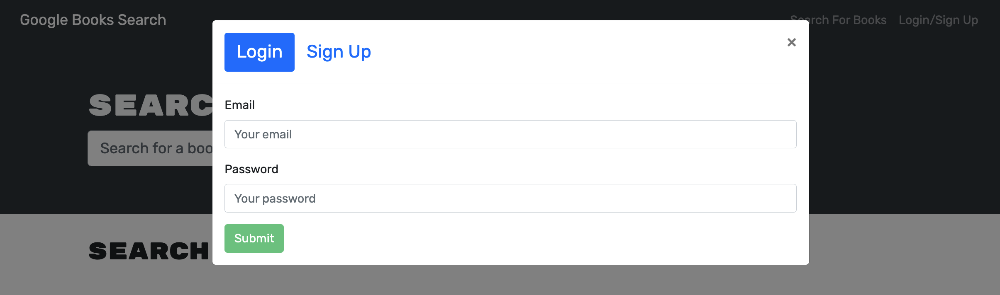
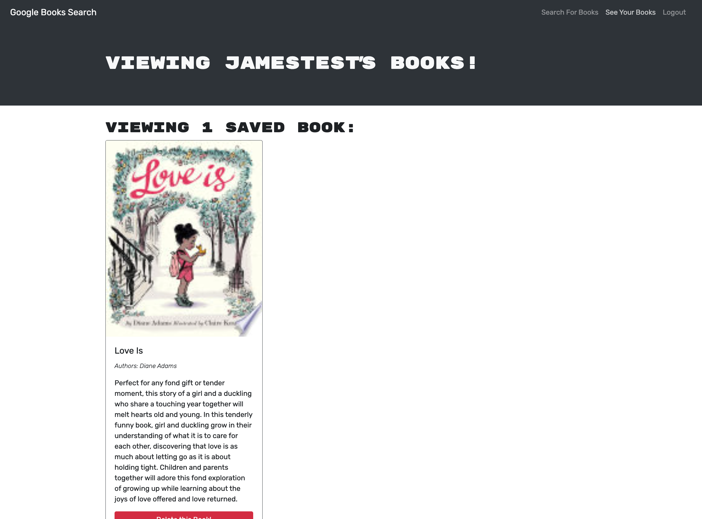

# Book Search Engine

- [Description](#description)
- [Installation](#installation)
- [Questions](#questions)
- [License](#license)

## Description

Google Books API search engine built in MERN Stack. Other than searching for books, users can sign up and login their account to save their favorive books.
## Installation

Clone the project and start with running the code `npm run install` followed by `npm run develop`

## Questions

Send me an email [here](mailto:james91055@gmail.com) to contact me directly.

## License

This project is licensed under the [MIT License](https://choosealicense.com/licenses/mit/) - click the link to read the license.

## Demo

